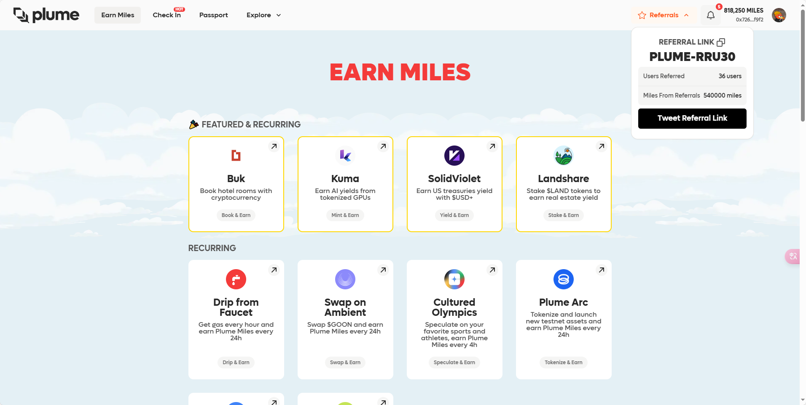
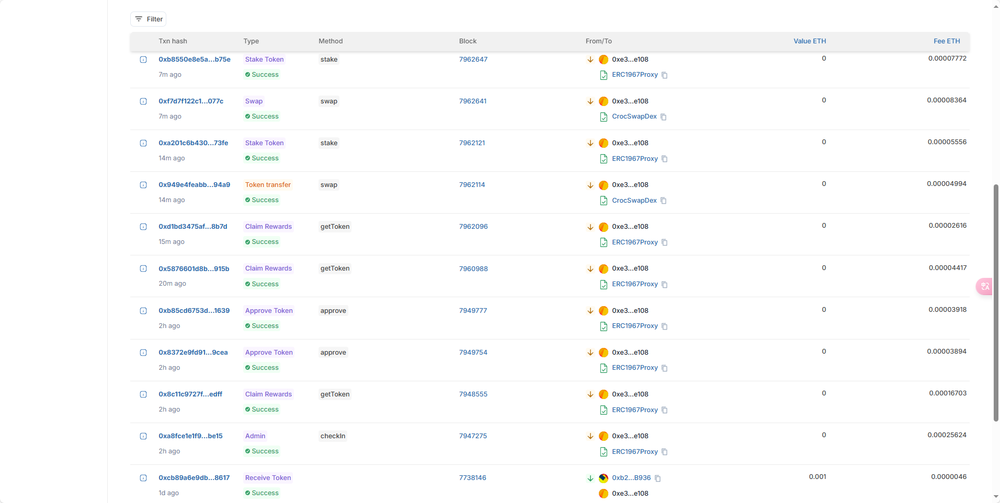

## PLUME TESTNET 机器人


### 声明

本程序仅供学习和演示目的，不用于任何商业用途，作者对程序的使用和任何可能的损失概不负责，在使用本程序前，请确保您理解风险，并根据自己的需要进行适当的测试和验证，使用本程序即表示您接受了这个免责声明。

### 联系方式

**QQ:** 854771076 

打赏地址(ETH)：`0x72691a36ED1fAC3b197Fb42612Dc15a8958bf9f2`

### 一、开发日志（持续更新中）

20240801-完成测试网交互基本功能，包括创建钱包、邀请下级、初次领水、每日合约领水（ETH，GOON）、GOON->gnUSD代币交换、gnUSD质押,等功能.

20240802-初次领水暂不可用（貌似是官网bug，新钱包暂不可领，手动也不行），钱包原来就有gas的不影响

20240806-完成Kuma NFT mint、swap

20240808-修复部分已知bug

### 二、功能介绍

1.新建/导入钱包并领取初始gas

2.邀请功能，输入邀请码后，创建钱包并初始化完成后，积分会计入大号



3.每日领水，每天领取ETH、GOON

4.每天交换领取的GOON为gnUSD

5.每天自动质押gnUSD


### 三、运行截图




### 四、使用教程

#### 4.1 环境安装

* 安装python3
* 安装第三方库pip install -r requirements.txt

#### 4.2 代理服务设置

* 找我添加服务白名单（收费）
* 修改以下代码

```python
# 修改代理服务接口地址
def __init__(...,proxy_api='http://zltiqu.pyhttp.taolop.com/getip?count=10&neek=42670&type=2&yys=0&port=2&sb=&mr=1&sep=0&ts=1'):
# 修改解析接口返回数据的方法
def get_proxy(self):
    with self._lock:
        if not self.ip_pool:
            # 解析
            self.ip_pool=requests.get(f"{self.proxy_api}").json().get('data',[{}])
            try:
                data=self.ip_pool.pop()
                except:
                    logger.error('本地ip，未有代理服务白名单，请更换代理或者开通白名单')
                    proxy={'proxy':f'{data["ip"]}:{data["port"]}'}
                    return proxy
```

#### 4.3 刷粉

```cmd
python add_invitor.py
```

#### 4.4 创建钱包并初始化领水

```cmd
python new_account.py
```

#### 4.5 日常任务（每天定时执行）

```cmd
python daily_task.py
```

